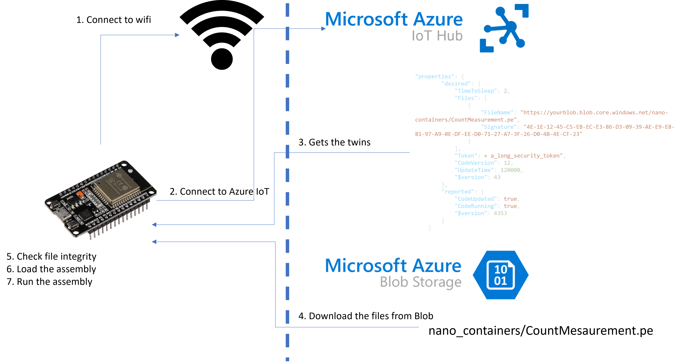

# 🌶️🌶️🌶️ - Azure Edge OTA example

This examples is a complete code Over the Air (OTA) example using Azure IoT. You have a detailed explanation on [this blog post](https://www.nanoframework.net/over-the-air-net-nanoframework-code-update-using-azure-iot/).



## Hardware requirements

An hardware device with networking capabilities running a nanoFramework image. 
This code has been tested with ESP32 boards. Note that there is a specific section to enable serial port logging. This can be replaced by any other board with networking capabilities.

The sample uses wifi, this part can be as well replaced with an ethernet connection. It will work the exact same way.

### Azure requirements

You'll need an [Azure IoT Hub](https://docs.microsoft.com/en-us/azure/iot-hub/iot-concepts-and-iot-hub) and a [Blob storage](https://docs.microsoft.com/en-us/azure/storage/blobs/). Make sure you select a standard Azure IoT Hub as you'll need the twin mechanism.

### Project structure

You'll find 4 different projects:

* The main application that runs on the device `AzureEdgeOTAEngine`. It does contains all the logic to connect to Azure IoT, get the device twins, download the code, check the integrity, run it dynamically.
* The sample application that is downloaded and loaded dynamically `CountMeasurement`. This is a very simple counter, you can of course take it and fully adjust it!
* An application that will upload on a blob storage what's needed and prepare the twin.
* A share project `OtaInterface` which contains shared elements for the PE file settings. This can be used more broadly across all projects if needed.s

### Secrets in AzureEdgeOTAEngine

You'll need few secrets to have this application working:

```csharp
public const string DeviceID = "your_device_id";
public const string IotBrokerAddress = "your_iot_hub.azure-devices.net";
public const string SasKey = "your_device_sas_key";
public const string Ssid = "your_wifi_ssid";
public const string Password = "your_wifi_password";
```

While this sample uses SAS token, you can use the same way certificates. If you're using certificates, they can be uploaded in the device directly. See in the [Azure library here](https://github.com/nanoframework/nanoFramework.Azure.Devices#storing-the-certificate-on-the-device).

You can the same way store your wifi secrets directly on the device as well. In this case, you'll have to adjust the few lines of code used for the wifi helper.

### Twin setup

You'll need to adjust your device twin to contain at minimum a `Files` array entry in the desired properties AND a `Token` to read the blob storage AND a `CodeVersion`:

```json
"Files":[{"FileName":"https://ellerbachiotstorage.blob.core.windows.net/nano-containers/CountMeasurement.pe","Signature":"7C-32-82-6D-00-17-E3-33-00-BE-E2-7C-06-EB-C1-E5-1F-09-2D-BF-4F-D6-E7-30-98-5A-2B-BE-E8-AC-CC-E9"}],
"Token":"a_long_sas_token",
"CodeVersion": 12,
```

The blob file will only be downloaded if there is a change in the `CodeVersion`. When downloading the file from the blob storage, the SHA256 signature will be verified. Once saved in the internal storage, it won't be checked again.

You can add more desired properties and use them of course. The sample counter application uses `"UpdateTime": 120000,` giving in milliseconds how often the counter should send the data to Azure.

### Find PE files and upload to blob storage

The `FindPeFiles` project will allow you to find the PE files which needs to be uploaded to a blob storage, upload them and give you the twin that needs to be added into your device. You can use this tool as command line or in debug. This is an example of the command line:

```shell
-e "C:\Repos\nanoFramework\Azure SDK\AzureEdgeOta\AzureEdgeOTAEngine\bin\Debug" -a "C:\Repos\nanoFramework\Azure SDK\AzureEdgeOta\CountMeasurement\bin\Debug" -c "https://yourblob.blob.core.windows.net/nano-containers" -t "sp=racwd&st=2022-02-23T08:36:22Z&se=2022-05-01T15:36:22Z&spr=https&sv=2020-08-04&sr=c&sig=somehtingsecrethere"
```

* The `-e` argument takes the core directory where your running OTA code has been build. It will look at the PE files here and assume all of them are deployed on the device.
* The `-a` argument points on the directory where the application you want to dynamically download and run is located. It will assume that the versions of the PE files that exist in the `-e` arguments is the same as those ones and only upload the PE files that are not present in the `-e` directory.
* The `-c` argument is the full path to the blob where the PE files will be uploaded.
* The `t` is the token to write, delete and update the blob storage. You can generate it automatically or thru the Azure portal.

The output will look like this:

```text
Input directory: C:\Repos\nanoFramework\Azure SDK\AzureEdgeOta\CountMeasurement\bin\Debug
Input directory: C:\Repos\nanoFramework\Azure SDK\AzureEdgeOta\AzureEdgeOTAEngine\bin\Debug
Connecting to Blob storage
Files to add to blob storage:
  C:\Repos\nanoFramework\Azure SDK\AzureEdgeOta\CountMeasurement\bin\Debug\CountMeasurement.pe
    File name: CountMeasurement.pe
    sha256: 7C-32-82-6D-00-17-E3-33-00-BE-E2-7C-06-EB-C1-E5-1F-09-2D-BF-4F-D6-E7-30-98-5A-2B-BE-E8-AC-CC-E9
    File uploaded: 0x8D9FAA6B7AAD97B

Twin for the device:
[{"FileName":"https://ellerbachiotstorage.blob.core.windows.net/nano-containers/CountMeasurement.pe","Signature":"7C-32-82-6D-00-17-E3-33-00-BE-E2-7C-06-EB-C1-E5-1F-09-2D-BF-4F-D6-E7-30-98-5A-2B-BE-E8-AC-CC-E9"}]
```

### Reference

- [nanoFramework.IoT.Device Bmxx80 devices](https://github.com/nanoframework/nanoFramework.IoT.Device/tree/develop/devices/Bmxx80).
- [Azure IoT documentation for MQTT](https://docs.microsoft.com/en-us/azure/iot-hub/iot-hub-mqtt-support).
- [nanoFramework Network helpers](https://github.com/nanoframework/Windows.Devices.Wifi)

## Build the sample

1. Simply adjust the device IoT Hub elements and your network
2. Start Microsoft Visual Studio 2019 by opening the solution
3. Add the connection information to the program.
4. Press Ctrl+Shift+B, or select **Build** \> **Build Solution**.

## Run the sample

The next steps depend on whether you just want to deploy the sample or you want to both deploy and run it.

**Important**: You won't be able to debug this sample as the device will very quickly go to sleep. If you want to debug, comment the part where it goes to sleep and replace with and infinite thread sleep timeout.

### Deploying the sample

- Select Build > Deploy Solution.

### Deploying and running the sample

- To debug the sample and then run it, press F5 or select Debug >  Start Debugging.
