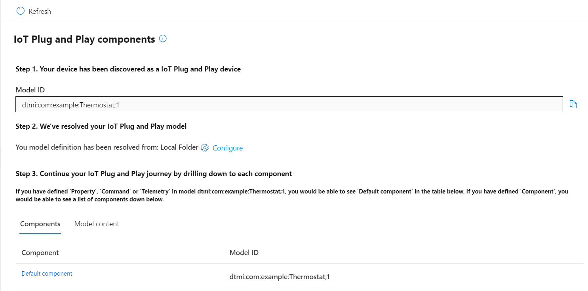
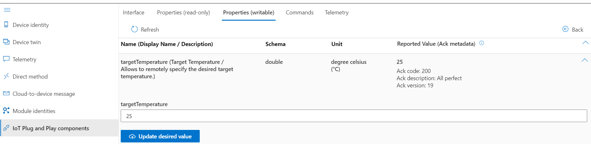
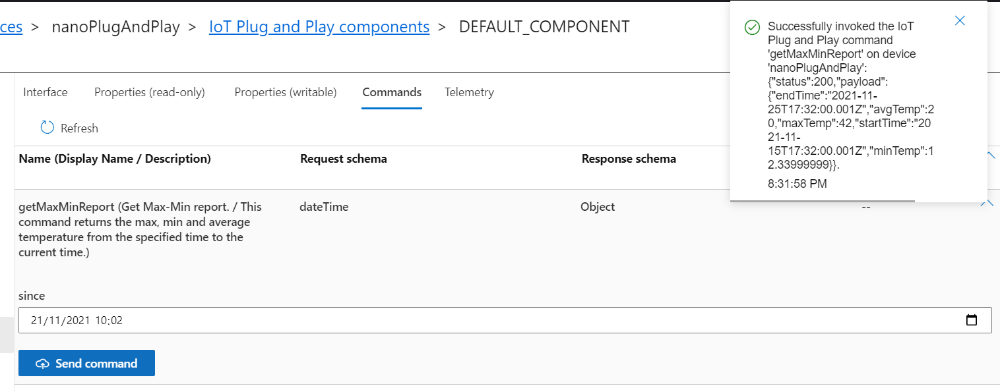
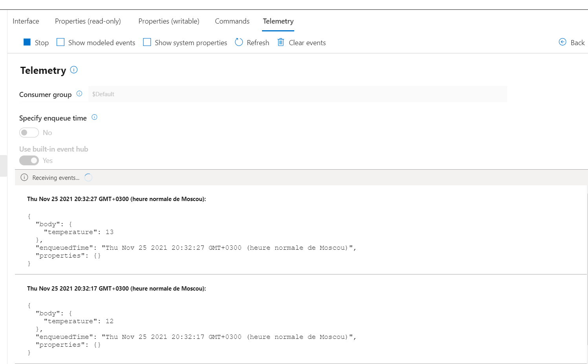
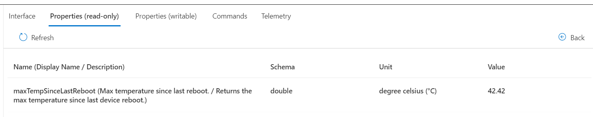

# 🌶️🌶️ - Azure IoT Plug & Play with MQTT protocol

This sample uses the .NET nanoFramework Azure IoT Plug & Play. You can find it here: <https://github.com/nanoframework/nanoFramework.Azure.Devices>. You will find in the main readme the detailed information as well.

Note: the samples include the Azure IoT certificate. You can as well upload it into your device as explained in the [main readme](https://github.com/nanoframework/nanoFramework.Azure.Devices).

The sample is [located here](./).

## Testing the sample

This sample uses a specific DTDL as an example, [you'll find it here](https://github.com/Azure/iot-plugandplay-models/blob/main/dtmi/com/example/thermostat-1.json). The Model ID is `dtmi:com:example:Thermostat;1`. This is what is going to be used in this sample.

You can use [Azure IoT Explorer](https://docs.microsoft.com/en-us/azure/iot-pnp/howto-use-iot-explorer) to run tests on the device.

When your device will connect, you'll see on the IoT Plug and Play components the Model ID. You'll have to import the model. You can download it from [here](https://github.com/Azure/iot-plugandplay-models/blob/main/dtmi/com/example/thermostat-1.json) and place it in a folder. Just use that folder for the source.

Here are examples of the results.

- Reporting the Writable Property:

- Sending a command and receiving the results:

Note: in the code the payload contains the parameters. In this case a simple date, we just ignore it for this sample purpose.

- Telemetry is sent as expected and is received as well:

- Reported properties will also show up. In this case, use the normal twin properties to report them.

**Important**: Method are case sensitive. Please make sure the way you call the method is the exact same way you name it in your C# code.
