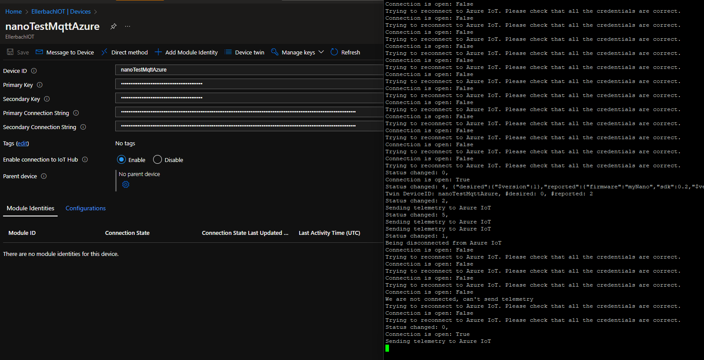

# 🌶️🌶️ - Simple sample **with** Azure lib and retry pattern for connection

Shows how to use the Azure IoT SDK library with a proper pattern to connect, reconnect, manage the connection. This leverages the [Azure SDK](https://github.com/nanoframework/nanoFramework.Azure.Devices).

Please make sure you enter properly your wifi credential and the Azure IoT device information.

You can test this sample by enabling and disabling the device in Azure IoT. You will see that you will get the various notifications for the connection and disconnection. The sample will behave without exception and will always try to reconnect properly:

## Hardware requirements

An hardware device with networking capabilities running a nanoFramework image.
This code has been tested with ESP32 boards. This can be replaced by any other board with networking capabilities.

The sample uses wifi, this part can be as well replaced with an ethernet connection. It will work the exact same way.

> **Important**: In this sample, if the connection or something is not setup properly you won't be able to debug properly. Please make sure you are using another sample to understand how Azure Client with a sample and deep sleep is working before using this one.

### Reference

- [Azure IoT documentation for MQTT](https://docs.microsoft.com/en-us/azure/iot-hub/iot-hub-mqtt-support).
- [nanoFramework Network helpers](https://github.com/nanoframework/System.Device.Wifi).
- [nanoFramework Azure IoT SDK](https://github.com/nanoframework/nanoFramework.Azure.Devices).

## Build the sample

1. Simply adjust the device IoT Hub elements and your network.
2. Start Microsoft Visual Studio 2019 by opening the solution.
3. Make sure you have your ESP32 showing up in the Device Explorer window.
4. Press `Ctrl+Shift+B`, or select **Build** \> **Build Solution**.

## Run the sample

**Important**: You can debug this sample only for one cycle as the device will very quickly go to sleep. If you want to debug, comment the part where it goes to sleep and replace with and infinite thread sleep timeout or a loop to once of the previous part of the code.
