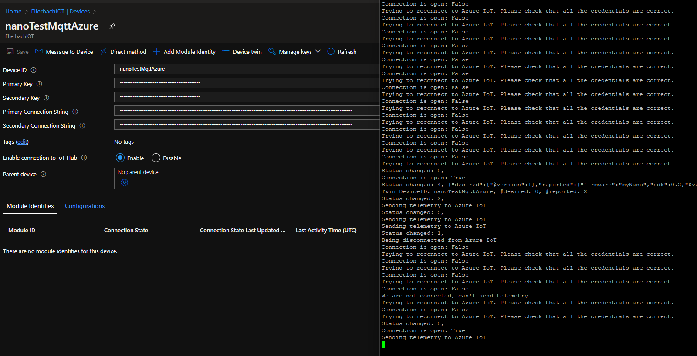

# 🌶️🌶️ - Using a Modem like SIM7080, simple sample **with** Azure lib and retry pattern for connection

Shows how to use the Azure IoT SDK library with a proper pattern to connect, reconnect, manage the connection using a modem like SIM7080 and the embedded MQTT client. This leverages the [Azure SDK](https://github.com/nanoframework/nanoFramework.Azure.Devices).

Please make sure you enter properly your wifi credential and the Azure IoT device information.

You can test this sample by enabling and disabling the device in Azure IoT. You will see that you will get the various notifications for the connection and disconnection. The sample will behave without exception and will always try to reconnect properly:

The sample is [located here](./).

## Hardware requirements

You need one modem supporting MQTT abstraction that is supported to use, see [current list here](https://github.com/nanoframework/nanoFramework.IoT.Device/tree/develop/devices/AtModem#documentation).
This code has been tested with ESP32 boards. This can be replaced by any other board. The is NO need to have networking capabilities. There is NO dependency on System.Net at all.

> **Important**: In this sample, if the connection or something is not setup properly you won't be able to debug properly. Please make sure you are using another sample to understand how Azure Client with a sample and deep sleep is working before using this one.

### Reference

- [AT Modem implementation](https://github.com/nanoframework/nanoFramework.IoT.Device/tree/develop/devices/AtModem).
- [Azure IoT documentation for MQTT](https://docs.microsoft.com/en-us/azure/iot-hub/iot-hub-mqtt-support).
- [nanoFramework Network helpers](https://github.com/nanoframework/System.Device.Wifi).
- [nanoFramework Azure IoT SDK](https://github.com/nanoframework/nanoFramework.Azure.Devices).

## Build the sample

1. Simply adjust the device IoT Hub elements and your network.
2. Start Microsoft Visual Studio 2019 by opening the solution.
3. Make sure you have your ESP32 showing up in the Device Explorer window.
4. Press `Ctrl+Shift+B`, or select **Build** \> **Build Solution**.

## Run the sample

**Important**: You can debug this sample only for one cycle as the device will very quickly go to sleep. If you want to debug, comment the part where it goes to sleep and replace with and infinite thread sleep timeout or a loop to once of the previous part of the code.
