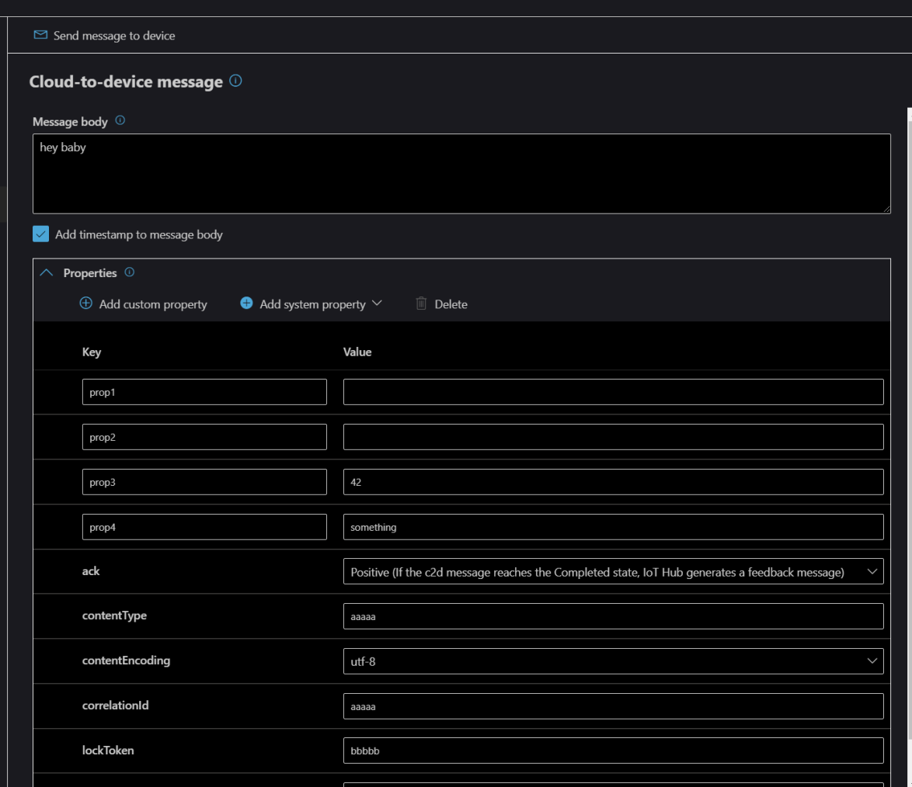
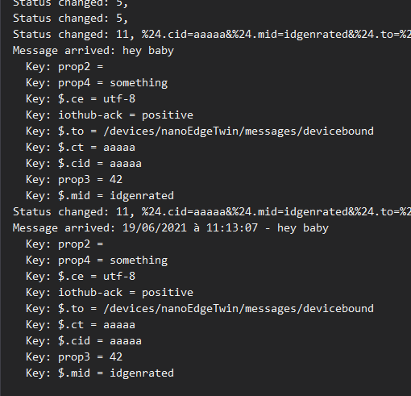
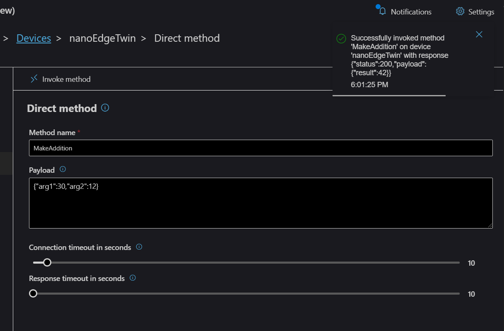
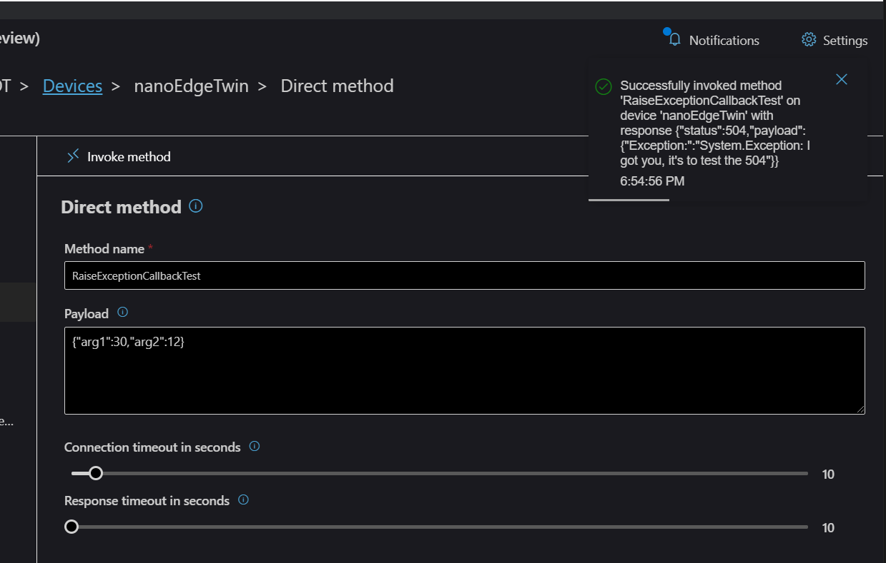

# Azure IoT Hub SDK with MQTT protocol

This sample uses the .NET nanoFramework Azure IoT Hub SDK with MQTT protocol. You can find it here: <https://github.com/nanoframework/nanoFramework.Azure.Devices>. You will find in the main readme the detailed information as well.

Note: the samples include the Azure IoT certificate. You can as well upload it into your device as explained in the [main readme](https://github.com/nanoframework/nanoFramework.Azure.Devices).

## Testing the sample

This sample uses a very popular BMP280 sensor. If you don't have this sensor, there is part of the code that is marked as comment. Just comment those lines and uncomment one of the line. This will simply simulate the sensor with static data.

You can use [Azure IoT Explorer](https://docs.microsoft.com/en-us/azure/iot-pnp/howto-use-iot-explorer) to run tests on the device.

Here are examples of the results.

- Cloud to device messages with properties:

Notes:

  - if you add the time stamp in the message, it is added to the message, you'll have to extract the core of the message in this case.
  - If a property is sent without anything like the prop1 should be, you will have its associated content set as null. The device explorer do not send those properties but it's technically possible.
  - In this example prop2 just have a space as value.

- Direct method call:

**Important**: Method are case sensitive. Please make sure the way you call the method is the exact same way you name it in your C# code.

- Direct Method generation an exception:

Note: as you can see the return code is 504 following the recommendation.
