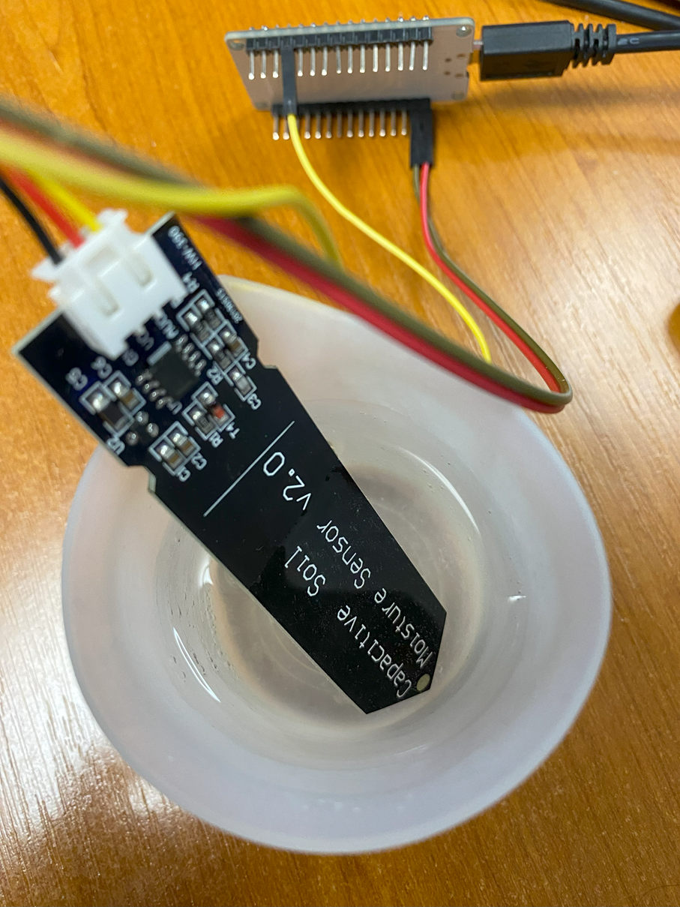

# 🌶️ - Read a soil moisture sensor with Analogic to Digital Converter (ADC)

Shows how to use the [System.Device.Adc](https://docs.nanoframework.net/api/System.Device.Adc.html) API to set GPIO pins.

We are using a capacitive soil moisture sensor for this experiment. You can any kind of moisture sensor that are analogic. They will all work the same way.

And if you want to know more about ADC, how this works, you can read the [All what you've always wanted to know about ADC](https://docs.nanoframework.net/content/getting-started-guides/adc-explained.html) content!

It's important to note that in this example, we are using the pin 34 which is ADC1 and channel 6. For each board, when you want to use ADC, you have to check the notion of channel. They are usuaklly not the same as the GPIO numbers. Keep that in mind!

So, just connect the measurement pin, here, the yellow one to pin 34, the red one to 3.3V and the black one to the ground.

Also note that for a specific usage, you may have to calibrate your analogic sensor. You can adjust in the code as well to see when you reach a specific limit. Enjoy!

## Running the sample

Ensure you have all the [software requirements](../README.md#software-requirements).

To build the sample, follow the section [here](../README.md#build-the-sample). And to run it, [here](../README.md#run-the-sample).

The sample is [located here](./Program.cs). The code is very straightforward with the explanations:

```csharp
// Licensed to the .NET Foundation under one or more agreements.
// The .NET Foundation licenses this file to you under the MIT license.

using System.Device.Adc;
using System.Diagnostics;
using System.Threading;
using nanoFramework.Hardware.Esp32;

Debug.WriteLine("Hello from nanoFramework!");

AdcController adc1 = new AdcController();

// Get the reference minimul and maximum values
int max1 = adc1.MaxValue;
int min1 = adc1.MinValue;

Debug.WriteLine("min1=" + min1.ToString() + " max1=" + max1.ToString());

// We will use the pin 34 which is already setup as ADC1_CH6
// If you want to change to use another pin, this function needs to be used to setup the pin
// Note, that not all configurations are possible. You'll have to refer to the ESP32 Technical Reference Manual
// or the board you're using to see which pins can be used as ADC.
// Configuration.SetPinFunction(34, DeviceFunction.ADC1_CH6);

AdcChannel sensor = adc1.OpenChannel(6);

while (true)
{
    // Read the raw value
    int rawValue = sensor.ReadValue();
    // Calculate the voltage
    // The ESP32 is using 3.3 V as the reference voltage
    // The ADC has a 12-bit resolution, so the maximum value is 4095
    // Still, using the AdcController.MaxValue and MinValue is a good practice
    double voltage = ((double)(rawValue - min1) / (max1 - min1)) * 3.3;
    Debug.WriteLine($"Raw Value: {rawValue}, Voltage: {voltage}");

    // Here, it's more empirical, you can adjust to your own needs
    // You can also use directly the raw value to compare
    if (voltage < 1.5)
    {
        Debug.WriteLine("It's wet!");
    }
    else
    {
        Debug.WriteLine("It's dry!");
    }

    Thread.Sleep(1000);
}

Thread.Sleep(Timeout.Infinite);
```

Place the sensor in water like this:



And as a result, you will see something like the following results. Note that it takes a bit of time to have the sensor adjusting to the change in humidity:

```text
min1=0 max1=4095
Raw Value: 3568, Voltage: 2.8753113553113554
It's dry!
Raw Value: 3583, Voltage: 2.8873992673992674
It's dry!
Raw Value: 3572, Voltage: 2.8785347985347984
It's dry!
Raw Value: 3367, Voltage: 2.7133333333333329
It's dry!
Raw Value: 3236, Voltage: 2.6077655677655676
It's dry!
Raw Value: 3029, Voltage: 2.44095238095238
It's dry!
Raw Value: 2859, Voltage: 2.3039560439560436
It's dry!
Raw Value: 2768, Voltage: 2.23062271062271
It's dry!
Raw Value: 2672, Voltage: 2.1532600732600731
It's dry!
Raw Value: 2515, Voltage: 2.0267399267399266
It's dry!
Raw Value: 2432, Voltage: 1.9598534798534796
It's dry!
Raw Value: 2319, Voltage: 1.8687912087912086
It's dry!
Raw Value: 2181, Voltage: 1.7575824175824176
It's dry!
Raw Value: 2106, Voltage: 1.6971428571428568
It's dry!
Raw Value: 2007, Voltage: 1.6173626373626373
It's dry!
Raw Value: 1919, Voltage: 1.5464468864468863
It's dry!
Raw Value: 1813, Voltage: 1.46102564102564
It's wet!
Raw Value: 1715, Voltage: 1.382051282051282
It's wet!
Raw Value: 1643, Voltage: 1.3240293040293041
It's wet!
Raw Value: 1590, Voltage: 1.2813186813186812
It's wet!
Raw Value: 1491, Voltage: 1.2015384615384614
It's wet!
Raw Value: 1410, Voltage: 1.1362637362637362
It's wet!
Raw Value: 1365, Voltage: 1.0999999999999999
It's wet!
Raw Value: 1346, Voltage: 1.0846886446886446
It's wet!
Raw Value: 1334, Voltage: 1.075018315018315
It's wet!
Raw Value: 1329, Voltage: 1.070989010989011
It's wet!
Raw Value: 1323, Voltage: 1.0661538461538462
It's wet!
Raw Value: 1322, Voltage: 1.0653479853479853
It's wet!
```

If you want to debug, foillow the instructions [explained in the led sample](../BlinkLed//README.md#debugging).