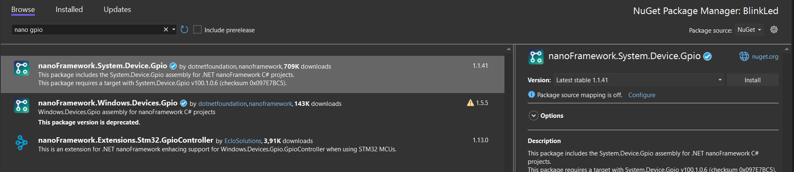
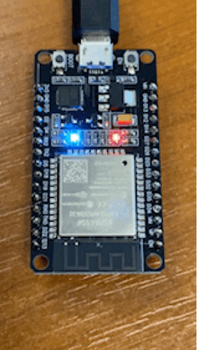
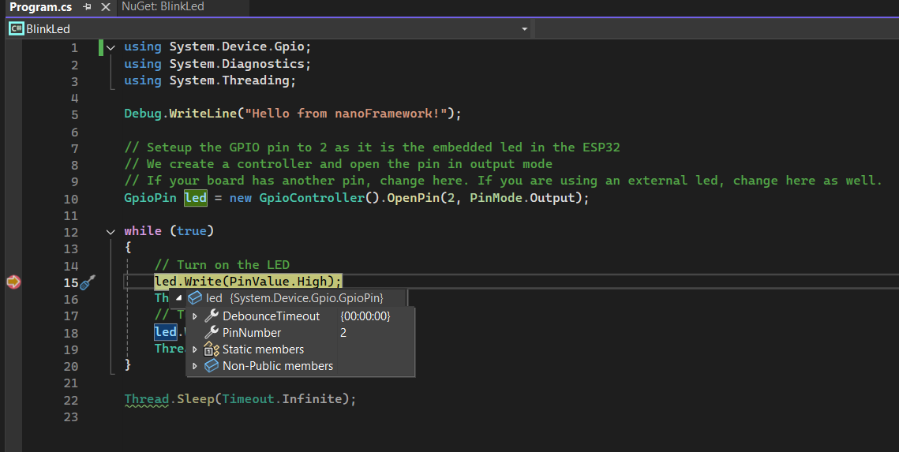

# 🌶️ - Blink your first LED

Shows how to use the [System.Device.Gpio](http://docs.nanoframework.net/api/System.Device.Gpio.html) API to set GPIO pins.

We will use the embedded LED present on the board for this case. You can also use an external LED with the 100-ohm resistor. You can follow the following schema:


And if you want to know more about GPIO, how this works, you can read the [All what you've always wanted to know about GPIO](https://docs.nanoframework.net/content/getting-started-guides/gpio-explained.html) content!

If you want to recreate the sample yourself, you'll just need to make sure that once you create a blank .NET nanoFramework application, you'll need to add the following NuGet package:



## Running the sample

Ensure you have all the [software requirements](../README.md#software-requirements).

To build the sample, follow the section [here](../README.md#build-the-sample). And to run it, [here](../README.md#run-the-sample).

The sample is [located here](./Program.cs). The code is very straightforward:

```csharp
using System.Device.Gpio;
using System.Diagnostics;
using System.Threading;

Debug.WriteLine("Hello from nanoFramework!");

// Setup the GPIO pin to 2 as it is the embedded LED in the ESP32
// We create a controller and open the pin in output mode
// If your board has another pin, change here. If you are using an external LED, change here as well.
GpioPin led = new GpioController().OpenPin(2, PinMode.Output);

while (true)
{
    // Turn on the LED
    led.Write(PinValue.High);
    Thread.Sleep(500);
    // Turn off the LED
    led.Write(PinValue.Low);
    Thread.Sleep(500);
}

Thread.Sleep(Timeout.Infinite);
```

As a result, you will see the led blinking like this:



## Debugging

With Visual Studio and the .NET nanoFramework extension, you can debug! Just place a breakpoint, hit F5 and the code will stop. You can also get the objects and their details!



You can also do step by step, change values and get access to the running threads.

> [!Warning]
> 
> Some elements can be time-sensitive when accessing the hardware. Placing a breakpoint and exploring the variables may not properly work. Also, while the debug experience is amazing, it can be slow for large objects. In general, try to avoid using the auto view.
