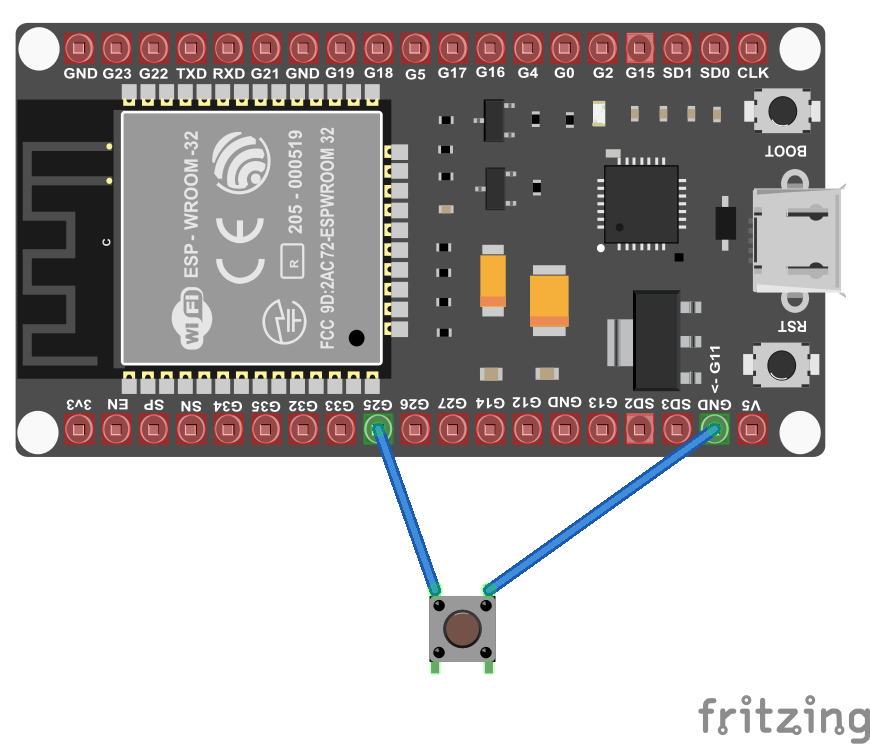
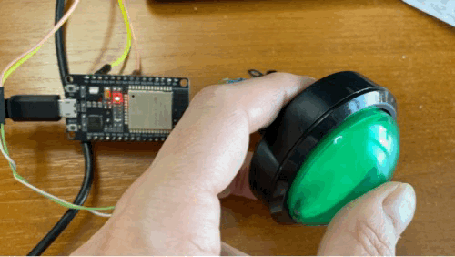

# 🌶️ - Press a button and light a LED with a Button nuget

Shows how to use the [Ioit.Device.Button](https://github.com/nanoframework/nanoFramework.IoT.Device/tree/develop/devices/Button) nuget.

We will use the embedded LED present on the board for this case. You can also use an external LED with the 100-ohm resistor. You can follow the following [schema](../BlinkLed/README.md). For the button, we will use the pin 25 but you can use almost any you want:



This example uses the button nuget. It does offers more than the [previous example with the simple button](../Button/). PArt of what it does offer is the ability to have events for the button pressed, released, down, clicked, doubled clicked, hold and all customizable!

## Running the sample

Ensure you have all the [software requirements](../README.md#software-requirements).

To build the sample, follow the section [here](../README.md#build-the-sample). And to run it, [here](../README.md#run-the-sample).

The sample is [located here](./Program.cs). The code is very straightforward with the explanations:

```csharp
using System;
using System.Device.Gpio;
using System.Diagnostics;
using System.Threading;
using Iot.Device.Button;

Debug.WriteLine("Hello from nanoFramework!");

// Create a GpioController, then create a GpioPin for the led and the button
var gpio = new GpioController();

// Setup the GPIO pin to 2 as it is the embedded led in the ESP32
// Open the pin in output mode
// If your board has another pin, change here. If you are using an external led, change here as well.
GpioPin led = gpio.OpenPin(2, PinMode.Output);

// Initialize a new button with the corresponding button pin
// You can adjust the pin number based on the pin you are using
// As for the simple button sample, it is using pull up by default
GpioButton button = new GpioButton(buttonPin: 25);

Debug.WriteLine("Button is initialized, starting to read state");

// Enable or disable holding or doublepress events
button.IsDoublePressEnabled = true;
button.IsHoldingEnabled = true;

// Write to debug if the button is down
button.ButtonDown += (sender, e) =>
{
    Debug.WriteLine($"buttondown IsPressed={button.IsPressed}");
    led.Write(PinValue.High);
};

// Write to debug if the button is up
button.ButtonUp += (sender, e) =>
{
    Debug.WriteLine($"buttonup IsPressed={button.IsPressed}");
    led.Write(PinValue.Low);
};

// Write to debug if the button is pressed
button.Press += (sender, e) =>
{
    Debug.WriteLine($"Press");
};

// Write to debug if the button is double pressed
button.DoublePress += (sender, e) =>
{
    Debug.WriteLine($"Double press");
};

// Write to debug if the button is held and released
button.Holding += (sender, e) =>
{
    switch (e.HoldingState)
    {
        case ButtonHoldingState.Started:
            Debug.WriteLine($"Holding Started");
            break;
        case ButtonHoldingState.Completed:
            Debug.WriteLine($"Holding Completed");
            break;
    }
};

Thread.Sleep(Timeout.Infinite);
```

And as a result, you will see:



In the debug output, you will also see text like this one depending on what you are doing with your button:

```text
buttondown IsPressed=True
buttonup IsPressed=False
Press
Double press
buttondown IsPressed=True
buttonup IsPressed=False
Press
buttondown IsPressed=True
buttonup IsPressed=False
Press
Double press
buttondown IsPressed=True
buttonup IsPressed=False
Press
buttondown IsPressed=True
buttonup IsPressed=False
Press
Double press
buttondown IsPressed=True
buttonup IsPressed=False
Press
buttondown IsPressed=True
buttonup IsPressed=False
Press
Double press
buttondown IsPressed=True
buttonup IsPressed=False
Press
buttondown IsPressed=True
buttonup IsPressed=False
Press
Double press
```

You can adjust the settings, the timing and play to see the behavior of your button!

If you want to debug, follow the instructions [explained in the led sample](../BlinkLed//README.md#debugging).
