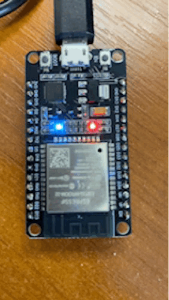

# 🌶️ - PWM and changing the light of a LED

Shows how to use the [System.Device.Pwm](https://docs.nanoframework.net/api/System.Device.Pwm.html) API to use Pulse Width Modulation pins.

We will use the embedded LED present on the board for this case. You can also use an external LED with the 100-ohm resistor. You can follow the following [schema](../BlinkLed/README.md).

And if you want to know more about PWM, how this works, you can read the [All what you've always wanted to know about PWM](https://docs.nanoframework.net/content/getting-started-guides/pwm-explained.html) content!

## Running the sample

Ensure you have all the [software requirements](../README.md#software-requirements).

To build the sample, follow the section [here](../README.md#build-the-sample). And to run it, [here](../README.md#run-the-sample).

The sample is [located here](./Program.cs). The code is very straightforward with the explanations:

```csharp
using System.Device.Pwm;
using System.Diagnostics;
using System.Threading;
using nanoFramework.Hardware.Esp32;

Debug.WriteLine("Hello from nanoFramework!");

// Pin 2 is the integrated LED in the ESP32, if you are using another board, change the pin number
int pinLed = 2;

// If you have an ESP32, you should setup the pin first to be used with PWM:
Configuration.SetPinFunction(pinLed, DeviceFunction.PWM1);

// Then you can create the PWM Channel from the pin:
PwmChannel pwmPin = PwmChannel.CreateFromPin(pinLed, 40000, 0);
// Note: even if possible, it is not recommended to adjust the frequency once created.

// Start the PWM
pwmPin.Start();

// Now, we will loop to increase and decrease the duty cycle
while (true)
{
    // We will increase the duty cycle by 1 percent every 20 milliseconds
    for (int i = 0; i <= 100; i++)
    {
        pwmPin.DutyCycle = (double)i / 100;
        Thread.Sleep(20);
    }

    // We will decrease the duty cycle by 1 percent every 20 milliseconds
    for (int i = 100; i >= 0; i--)
    {
        pwmPin.DutyCycle = (double)i / 100;
        Thread.Sleep(20);
    }
}

Thread.Sleep(Timeout.Infinite);
```

And as a result, you will see:



If you want to debug, follow the instructions [explained in the led sample](../BlinkLed//README.md#debugging).
