# 🌶️ - Special IoT beginner content with .NET nanoFramework

Welcome to the beginner series for .NET nanoFramework! This series is designed to help you get started with IoT development using .NET nanoFramework. Whether you are new to IoT or have some experience, these tutorials will guide you through the basics and beyond.

In this series, you will learn how to:

- Use General Purpose Input/Output (GPIO) to interact with [buttons](./Button/), [LEDs](./BlinkLed/), [advance button](./ButtonNuget/), and other digital devices.
- Implement Pulse Width Modulation (PWM) to [control the brightness of LEDs](./PwmLed/), [play music with a buzzer](./Buzzer/) and [moving a servo motor](./ServoMotor/).
- Utilize Analog-to-Digital Converters (ADC) to read [analog soil moisture sensors](./AnalogRainSensor/).
- Use I2C to read air temperature and humidity sensor.

Each topic will include detailed explanations and step-by-step examples to help you understand and implement these features in your projects. By the end of this series, you will have a solid foundation in using .NET nanoFramework for your IoT applications.

Let's get started and explore the exciting world of IoT with .NET nanoFramework!

## Software requirements

To follow along with this series, you will need:

- Visual Studio 2022 ([the free Community edition](https://visualstudio.microsoft.com/vs/community/) works perfectly)
- .NET nanoFramework extension for Visual Studio

You can follow the [getting started guide](https://docs.nanoframework.net/content/getting-started-guides/index.html) to install Visual Studio and the .NET nanoFramework extension.

## Hardware requirements

For this series, we will use a very common ESP32 board, the ESP32-DevKit. They can also be found with the name ESP32 NodeMCU. They are all based on the ESP32-WROOM-32 Microcontroller Unit (MCU). These boards are easy to find, cheap, and great for getting started. The samples will work with almost any board supported by .NET nanoFramework.

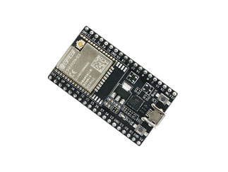

For the samples, we will need:

- An LED, any color of your choice!

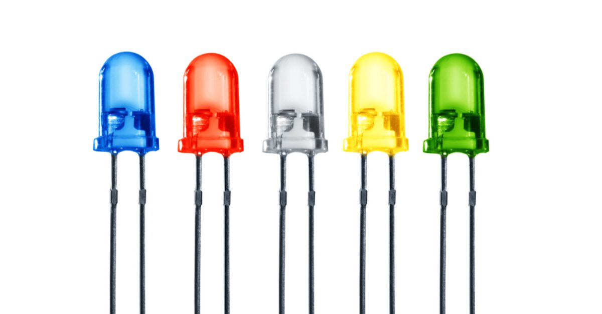

- A 100-ohm resistor (anything between 70 to 120 ohms will also work), so it's a brown-black-brown resistor:

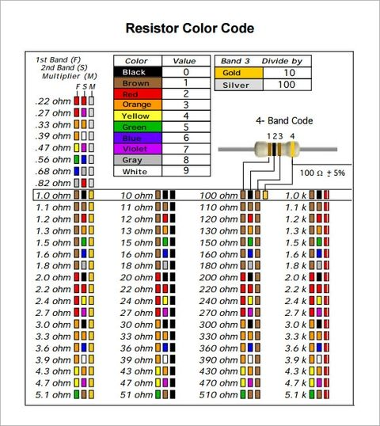

- A small button (any will do!)

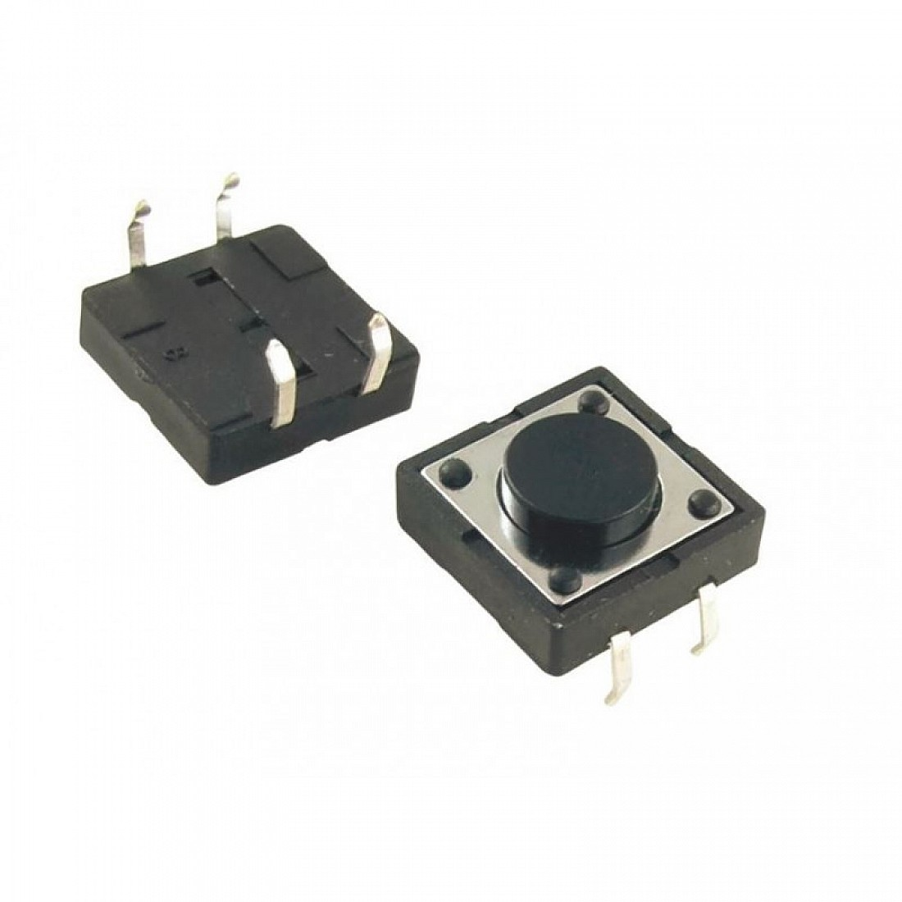

- A buzzer (any type will do!)

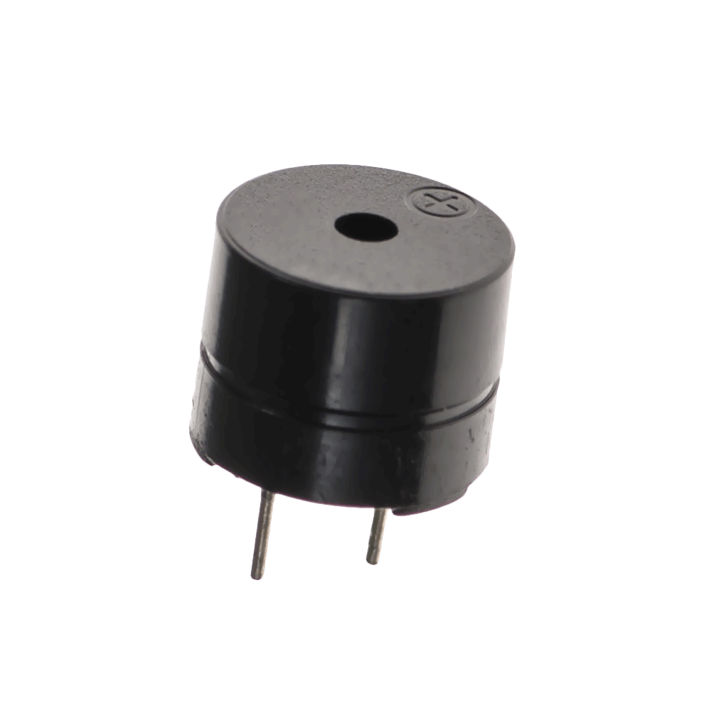

- A capacitive soil humidity sensor (it will also work with a resistive soil humidity sensor)

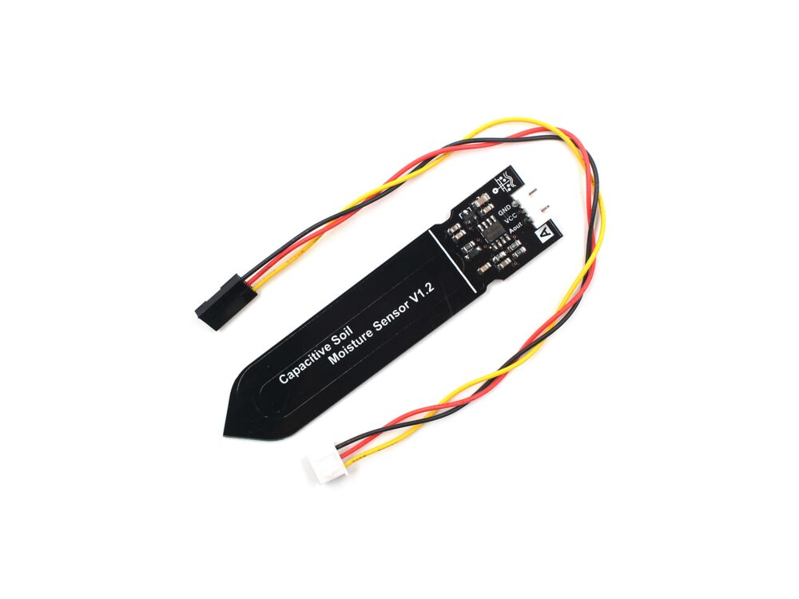

- An AM2320 I2C humidity and temperature sensor (note that with adjustments the code will work with other sensors as well)

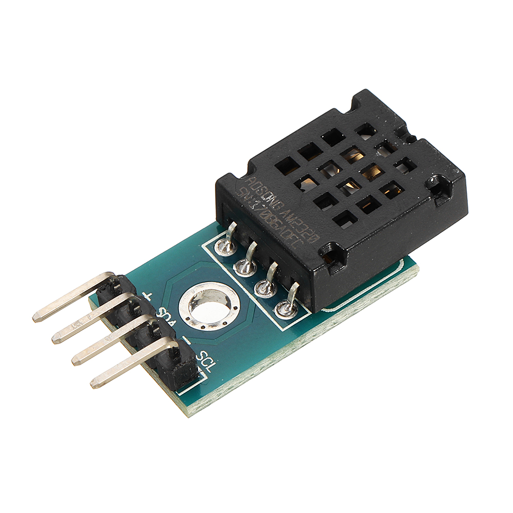

- A servo motor of any kind

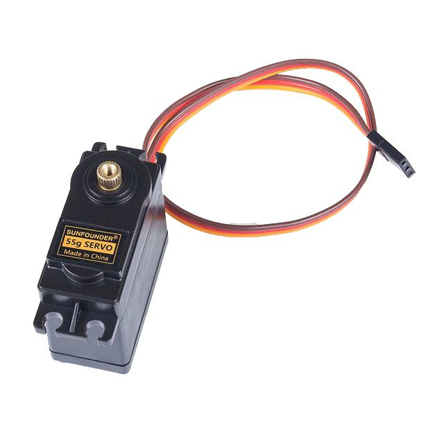

## Build the sample

1. Start Microsoft Visual Studio 2022 and select `File > Open > Project/Solution` and select the `Beginner.sln`.
1. Press `Ctrl+Shift+B`, or select `Build > Build Solution`.

## Run the sample

You need to have your device flashed. To easily find out on which serial port your device is connected, run the command `nanoff --listports` first without your device connected, then with the device connected:

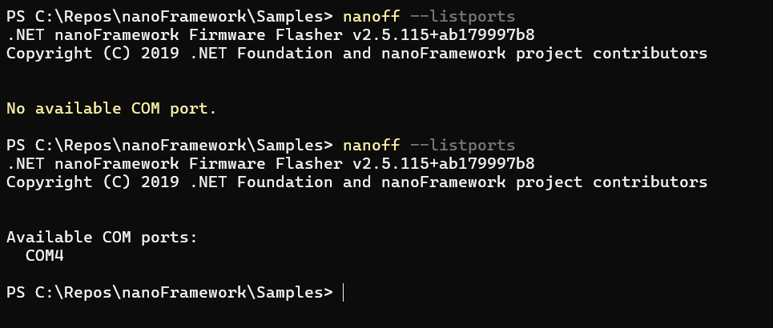

In my case, the serial port is COM4!

Then flash your device using `nanoff --platform ESP32 --masserase --update --serialport COM4`, just replace the proper serial port with your device port name.

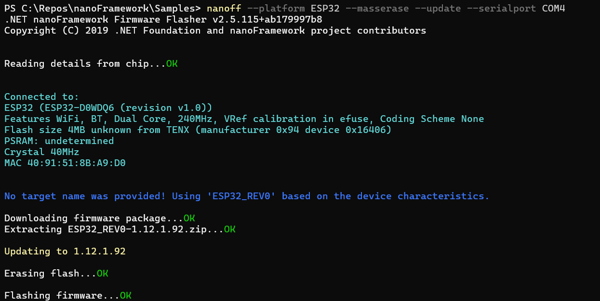

The device will be automatically recognized and the latest and greatest firmware will be installed. Note: this is required only once or in case of problems. Once flashed, your device can deploy and run the samples as many times as you want.

Right-click on the solution you want to run and select `Set as Startup Project`.

Make sure that in the `Device Explorer` you have your board selected:

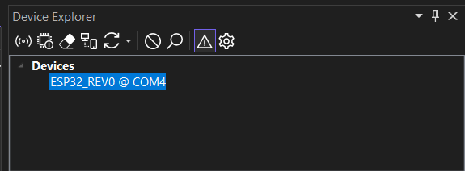

- To debug the sample and then run it, press F5 or select `Debug > Start Debugging`.

> [!NOTE]
>
> **Important**: Before deploying or running the sample, please make sure your device is visible in the Device Explorer.
>
> **Tip**: To display the Device Explorer, go to Visual Studio menus: `View > Other Windows > Device Explorer`.
>
> **Tip**: In case your device is not recognized when you are trying to flash it, try to close Visual Studio and try to flash it again! See our [device connection troubleshooting](https://docs.nanoframework.net/content/getting-started-guides/troubleshooting-device-connection.html) for more insights.
