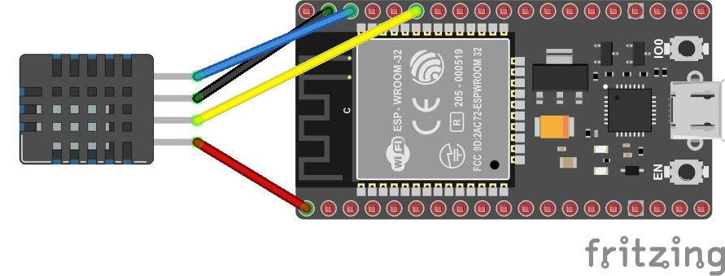

# 🌶️ - Reading an AM2320 I2C Temerature and Humidity sensor

Shows how to use the [System.Device.I2c](https://docs.nanoframework.net/api/System.Device.I2c.html) API to use Inter-Integrated Circuit (I2C).

We will use an AM2320 temperature and humidity I2C sensor. We will connect pin 21 to the Data pin (called often SDA) and 22 to the Clock pin (called often SCL). Plus 3.3V to VCC and Ground to Ground. Note that ESP32 have an internal pull-up resistor for the I2C bus. It's not the case for all the MCU. You may have to add one between the Data and Clock pin and the the VCC pin. In the case of 3.3V, 1.8 K ohms will be perfect.



And if you want to know more about I2C and why we need pull-up resistors, how this works, you can read the [All what you've always wanted to know about I2C](https://docs.nanoframework.net/content/getting-started-guides/i2c-explained.html) content!

## Running the sample

Ensure you have all the [software requirements](../README.md#software-requirements).

To build the sample, follow the section [here](../README.md#build-the-sample). And to run it, [here](../README.md#run-the-sample).

The sample is [located here](./Program.cs). The code is very straightforward with the explanations:

```csharp
using Iot.Device.Am2320;
using nanoFramework.Hardware.Esp32;
using System.Device.I2c;
using System.Diagnostics;
using System.Threading;

Debug.WriteLine("Hello from AM2320!");

//////////////////////////////////////////////////////////////////////
// when connecting to an ESP32 device, need to configure the I2C GPIOs
// used for the bus
Configuration.SetPinFunction(21, DeviceFunction.I2C1_DATA);
Configuration.SetPinFunction(22, DeviceFunction.I2C1_CLOCK);

// If you are using another I2C temperature and humidity sensor, you will have to adjust the name of the class.
// You will also have to adjust the I2C address if it is different.
using Am2320 am2330 = new(new I2cDevice(new I2cConnectionSettings(1, Am2320.DefaultI2cAddress, I2cBusSpeed.StandardMode)));

while (true)
{
    // Most temperature and humidity sensors have a temperature and humidity property.
    var temp = am2330.Temperature;
    var hum = am2330.Humidity;

    // In most of the cases, you will have to check if the last read was successful.
    // It happens that a read fails because of a timing issue for example.
    if (am2330.IsLastReadSuccessful)
    {
        Debug.WriteLine($"Temp = {temp.DegreesCelsius} C, Hum = {hum.Percent} %");
    }
    else
    {
        Debug.WriteLine("Not sucessfull read");
    }

    // And it's important to wait a little bit before reading again.
    // All sensors have a limit, it's important to check the datasheet.
    // In our case, we usually have a property like this one.
    Thread.Sleep(Am2320.MinimumReadPeriod);
}
```

And as a result, you will see:

```text
Hello from AM2320!
Temp = 28.3 C, Hum = 36.9 %
Temp = 28.5 C, Hum = 36.299999999999999 %
Temp = 28.5 C, Hum = 36 %
Temp = 28.5 C, Hum = 35.6 %
Temp = 28.5 C, Hum = 35.299999999999998 %
Temp = 28.5 C, Hum = 35.1 %
Temp = 28.5 C, Hum = 34.899999999999998 %
Temp = 28.5 C, Hum = 34.5 %
Temp = 28.5 C, Hum = 34.5 %
Temp = 28.399999999999999 C, Hum = 33.6 %
Temp = 28.399999999999999 C, Hum = 33.299999999999996 %
Temp = 28.399999999999999 C, Hum = 33 %
Temp = 28.3 C, Hum = 33 %
```

If you want to debug, follow the instructions [explained in the led sample](../BlinkLed//README.md#debugging).
