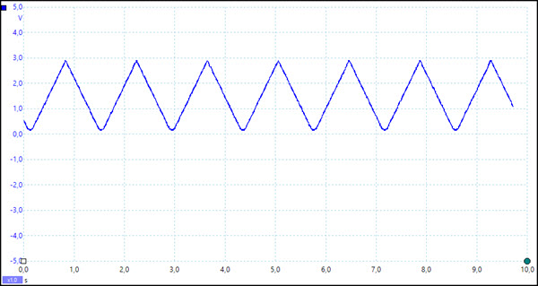
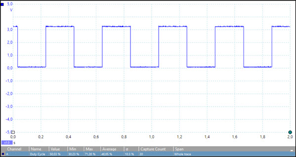
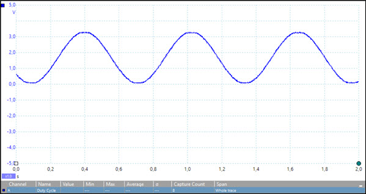

# **D**igital **A**nalog **C**onverter sample pack

Shows how to use the [System.Devices.Dac](http://docs.nanoframework.net/api/System.Devices.Dac.html) API to output values to a DAC.

> **Note:** This sample is part of a large collection of nanoFramework feature samples.
> If you are unfamiliar with Git and GitHub, you can download the entire collection as a
> [ZIP file](https://github.com/nanoframework/Samples/archive/master.zip), but be
> sure to unzip everything to access any shared dependencies.
<!-- For more info on working with the ZIP file, 
> the samples collection, and GitHub, see [Get the UWP samples from GitHub](https://aka.ms/ovu2uq). 
> For more samples, see the [Samples portal](https://aka.ms/winsamples) on the Windows Dev Center.  -->

This sample allows the developer to output several output sequences to the **D**igital **A**nalog **C**onverter. You can choose one of three scenarios:

## Scenarios

### Instantiate and configure DAC peripheral

This scenario demonstrates the how to instantiate the device default DAC controller and use it's property APIs in order to grab information about the DAC resolution in order to adjust the samples output.

### Output a triangle wave

This scenario demonstrates the use the DAC to output a triangle wave.

### Output a square wave

This scenario demonstrates the use the DAC to output a square wave.

### Output a sine wave

This scenario demonstrates the use the DAC to output a sine wave.

## Hardware requirements

Any hardware device running a nanoFramework image built with serial communication enabled.
This sample is coded to use the STM32F769IDiscovery target board, but can be easily changed to any other target that features a serial port.

## Related topics

### Samples

[SerialCommunication sample](/SerialCommunication)

### Reference

[Windows.Devices.SerialCommunication](http://docs.nanoframework.net/api/Windows.Devices.SerialCommunication.html)

<!-- [nanoFramework app samples]() -->

## System requirements

**Client:** Windows 10

## Build the sample

1. If you download the samples ZIP, be sure to unzip the entire archive, not just the folder with the sample you want to build. 
2. Start Microsoft Visual Studio 2017 and select **File** \> **Open** \> **Project/Solution**.
3. Starting in the folder where you unzipped the samples, go to the subfolder for this specific sample. Double-click the Visual Studio Solution (.sln) file.
4. Press Ctrl+Shift+B, or select **Build** \> **Build Solution**.

## Run the sample

The next steps depend on whether you just want to deploy the sample or you want to both deploy and run it.

### Deploying the sample

- Select Build > Deploy Solution.

### Deploying and running the sample

- To debug the sample and then run it, press F5 or select Debug >  Start Debugging. To run the sample without debugging, press Ctrl+F5 or selectDebug > Start Without Debugging.
