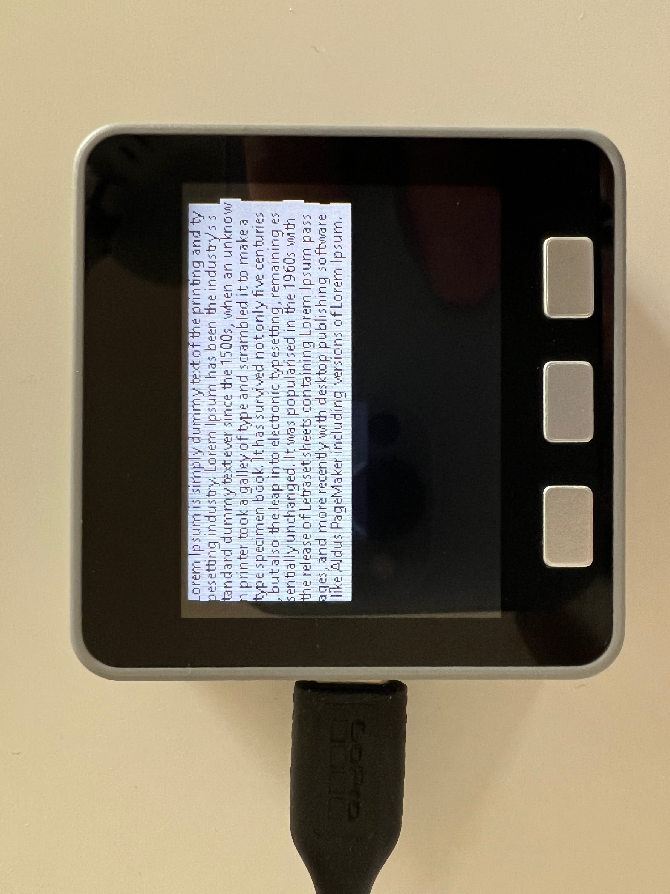

# 🌶️🌶️ - Screen samples

These samples demonstrate the low level text display and graphics display functions that are available.

These are very useful for memory constrained devices with smaller screens.

To initialize the screen, `DisplayControl.Initialize`, requires `SPIConfiguration` and `ScreenConfiguration` please check below.

If `backLightPin` and `reset` are not used, you can use `-1` as a value. `ScreenConfiguration` requires screen size of your actual screen as `screenWidth` and `screenHeight`.

```csharp
DisplayControl.Initialize(
    new SpiConfiguration(spiBus, chipSelect, dataCommand, reset, backLightPin), 
    new ScreenConfiguration(0, 0, screenWidth, screenHeight),
    screenBufferSize);
```

For different font family and font sizes, you can generate tinyfont. You can find more information about tinyfont on [this blog](http://informatix.miloush.net/microframework/Utilities/TinyFontTool.aspx)

## M5Stack Screen

[M5Stack Screen](m5stack-screen) was tested in:

- [M5Stack gray](https://shop.m5stack.com/products/grey-development-core?variant=16804796006490)

The features demonstrated are:

- Text display and formatting.

Configuration:

```csharp
// pins for SPI Configuration
backLightPin = 32;
chipSelect = 14;
dataCommand = 27;
reset = 33;

// set MISO, MOSI and CLOCK pins
Configuration.SetPinFunction(19, DeviceFunction.SPI1_MISO);
Configuration.SetPinFunction(23, DeviceFunction.SPI1_MOSI);
Configuration.SetPinFunction(18, DeviceFunction.SPI1_CLOCK);
```

When running this sample, the end result in the screen looks like this:



## M5Stick Screen

[M5Stick Screen](m5stick-screen) was tested in:

- [M5StickC plus](https://shop.m5stack.com/collections/stick-series/products/m5stickc-plus-esp32-pico-mini-iot-development-kit)

Before displaying the screen don't forget to initialize AXP192 first, you can check `InitiM5Stick()` in `Program.cs` of `m5stick.screen` sample. The features demonstrated are:

- Using [AXP192](https://github.com/nanoframework/nanoFramework.IoT.Device/tree/develop/devices/Axp192) to initialize the screen
- Graphics display and formatting.
- Text display and formatting.

Configuration:

```csharp
// pins for SPI Configuration
int backLightPin = -1;
int chipSelect = 5;
int dataCommand = 23;
int reset = 18;

// set MISO, MOSI and CLOCK pins
Configuration.SetPinFunction(4, DeviceFunction.SPI1_MISO);
Configuration.SetPinFunction(15, DeviceFunction.SPI1_MOSI);
Configuration.SetPinFunction(13, DeviceFunction.SPI1_CLOCK);
```

## Wroover

Configuration:

```csharp
// pins for SPI Configuration
backLightPin = 5;
chipSelect = 22;
dataCommand = 21;
reset = 18;

// set MISO, MOSI and CLOCK pins
Configuration.SetPinFunction(19, DeviceFunction.SPI1_MISO);
Configuration.SetPinFunction(23, DeviceFunction.SPI1_MOSI);
Configuration.SetPinFunction(18, DeviceFunction.SPI1_CLOCK);
```
