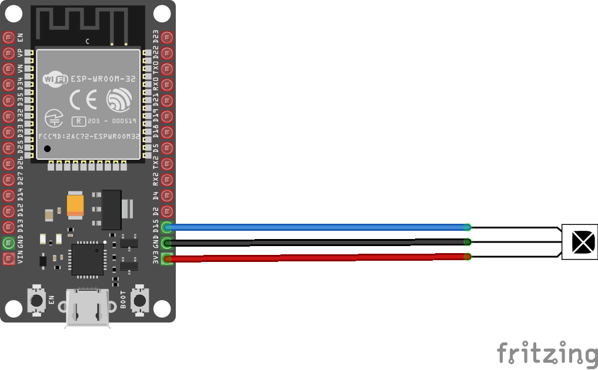

# 🌶️🌶️ - Infrared remote receiver based on VS1838 with RMT

Shows how to use ESP32 RMT with VS1838 infrared receiver to create remote. Nec protocol parser is defined with base class for other protocols.

See explanation of Nec protocol: [Nec protocol doc](https://www.sbprojects.net/knowledge/ir/nec.php)

The sample is [located here](./InfraredRemoteReceiverSample/).

## Connections

- DATA - Any available GPIO pin, D15 in this case
- VCC -  3.3V
- GND -  Ground signal



## Hardware requirements

Any ESP32 hardware device running a nanoFramework image.

## Behavior of application

It may happen, especially with poor quality remotes, that signal won't be recognized at first trial. With Arduino DevKit remote, which uses Nec protocol, it works better when buttons are pressed once an shortly as otherwise it will send repeat command. That repeat might be included into origin message by RMT.

Example of correct message:

```
Length:34
new RmtSymbol(9375,false,4441,true),
new RmtSymbol(666,false,515,true),
new RmtSymbol(665,false,511,true),
new RmtSymbol(665,false,512,true),
new RmtSymbol(666,false,512,true),
new RmtSymbol(666,false,511,true),
new RmtSymbol(649,false,529,true),
new RmtSymbol(664,false,513,true),
new RmtSymbol(663,false,513,true),
new RmtSymbol(664,false,1595,true),
new RmtSymbol(665,false,1592,true),
new RmtSymbol(665,false,1593,true),
new RmtSymbol(661,false,1596,true),
new RmtSymbol(660,false,1597,true),
new RmtSymbol(661,false,1594,true),
new RmtSymbol(636,false,1621,true),
new RmtSymbol(644,false,1612,true),
new RmtSymbol(633,false,543,true),
new RmtSymbol(631,false,1626,true),
new RmtSymbol(633,false,543,true),
new RmtSymbol(630,false,1626,true),
new RmtSymbol(659,false,1598,true),
new RmtSymbol(656,false,520,true),
new RmtSymbol(629,false,1627,true),
new RmtSymbol(634,false,542,true),
new RmtSymbol(629,false,1628,true),
new RmtSymbol(655,false,521,true),
new RmtSymbol(629,false,1628,true),
new RmtSymbol(655,false,521,true),
new RmtSymbol(630,false,545,true),
new RmtSymbol(630,false,1627,true),
new RmtSymbol(633,false,544,true),
new RmtSymbol(647,false,1612,true),
new RmtSymbol(658,false,0,true),

Protocol: 1 Address: 0 Command: 90 from Payload: 00000000111111110101101010100101
```

Example of correct repeat message:

```
Length:2
new RmtSymbol(9371,false,2178,true),
new RmtSymbol(661,false,0,true),

Protocol: 1 Address: 0 Command: 90 from Payload: 00000000111111110101101010100101
```

Example of correct message mixed with repeat, see length = 36 pulses:

```
Length:36
new RmtSymbol(9288,false,4530,true),
new RmtSymbol(572,false,585,true),
new RmtSymbol(592,false,606,true),
new RmtSymbol(572,false,606,true),
new RmtSymbol(596,false,581,true),
new RmtSymbol(572,false,583,true),
new RmtSymbol(620,false,560,true),
new RmtSymbol(593,false,606,true),
new RmtSymbol(573,false,604,true),
new RmtSymbol(595,false,1662,true),
new RmtSymbol(572,false,1687,true),
new RmtSymbol(570,false,1663,true),
new RmtSymbol(620,false,1660,true),
new RmtSymbol(573,false,1685,true),
new RmtSymbol(596,false,1660,true),
new RmtSymbol(571,false,1662,true),
new RmtSymbol(621,false,1660,true),
new RmtSymbol(572,false,605,true),
new RmtSymbol(571,false,606,true),
new RmtSymbol(598,false,1637,true),
new RmtSymbol(593,false,1686,true),
new RmtSymbol(596,false,580,true),
new RmtSymbol(571,false,606,true),
new RmtSymbol(596,false,558,true),
new RmtSymbol(593,false,590,true),
new RmtSymbol(585,false,1686,true),
new RmtSymbol(571,false,1687,true),
new RmtSymbol(596,false,581,true),
new RmtSymbol(594,false,584,true),
new RmtSymbol(595,false,1665,true),
new RmtSymbol(595,false,1663,true),
new RmtSymbol(595,false,1663,true),
new RmtSymbol(569,false,1689,true),
new RmtSymbol(570,false,6751,true),
new RmtSymbol(9340,false,2214,true),
new RmtSymbol(624,false,0,true),

Protocol: 0 Address: -1 Command: -1 from Payload: 
```

## Build the sample

1. Start Microsoft Visual Studio 2022 and select `File > Open > Project/Solution`.
1. Starting in the folder where you unzipped the samples/cloned the repository, go to the subfolder for this specific sample. Double-click the Visual Studio Solution (.sln) file.
1. Press `Ctrl+Shift+B`, or select `Build > Build Solution`.

## Run the sample

The next steps depend on whether you just want to deploy the sample or you want to both deploy and run it.

### Deploying the sample

- Select `Build > Deploy Solution`.

### Deploying and running the sample

- To debug the sample and then run it, press F5 or select `Debug > Start Debugging`.

> [!NOTE]
>
> **Important**: Before deploying or running the sample, please make sure your device is visible in the Device Explorer.
>
> **Tip**: To display the Device Explorer, go to Visual Studio menus: `View > Other Windows > Device Explorer`.
