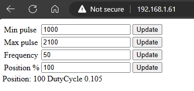

# 🌶️🌶️ - WebServer to test pour Servo Motors

Shows how to use the [nanoFramework WebServer](http://https://github.com/nanoframework/nanoFramework.WebServer) and the [System.Device.Pwm](https://docs.nanoframework.net/api/System.Device.Pwm.html) to test your servo motors.

## Hardware requirements

This sample is using an ESP32 connected in WiFi but it can work with any other device that does support PWM and networking. You will have to adjust the Ethernet connection instead of WiFi and adjust the PWM initialization and also remove the non needed nugets.

You will also need a servo motor as the core idea is to test the servo motor!

> [!IMPORTANT]
>
> You have to make sure that the servo motor has a proper power of 5V. The driver pin can be used directly from the device.
>
> Please also make sure you adjust your WiFi credentials and the GPIO pin used for the servo motor.

## Usage

Just connect to the IP Address of your device with a browser. You will have the following experience:

You can update any single element individually. The minimum and maximum pulses are in micro seconds. You can find them in the documentation of the servo motor. If you don't know or want to find out the limits of your servo motor, you can adjust individually. The position goes from 0 to 100 and it's the position from the minimum pulse (Position = 0) to the maximum pulse (Position = 100).

The result of the adjusted element(s) and the associated PWM Duty Cycle is displayed.

## Reference

- [nanoFramework WebServer](http://https://github.com/nanoframework/nanoFramework.WebServer)
- [System.Device.Pwm](https://docs.nanoframework.net/api/System.Device.Pwm.html)
- This is a modern implementation of this almost [10 years old .NET Microframework implementation](https://ellerbach.github.io/blog-posts/2015-01-09-Servo-motor-tester-in-NETMF-(.NET-Micro-Framework)-with-Netduino.html).

## Build the sample

1. Start Microsoft Visual Studio 2022 or Visual Studio 2019 (Visual Studio 2017 should be OK too) and select `File > Open > Project/Solution`.
1. Starting in the folder where you unzipped the samples/cloned the repository, go to the subfolder for this specific sample. Double-click the Visual Studio Solution (.sln) file.
1. Press `Ctrl+Shift+B`, or select `Build > Build Solution`.

## Run the sample

The next steps depend on whether you just want to deploy the sample or you want to both deploy and run it.

### Deploying the sample

- Select `Build > Deploy Solution`.

### Deploying and running the sample

- To debug the sample and then run it, press F5 or select `Debug > Start Debugging`.

> [!NOTE]
>
> **Important**: Before deploying or running the sample, please make sure your device is visible in the Device Explorer.
>
> **Tip**: To display the Device Explorer, go to Visual Studio menus: `View > Other Windows > Device Explorer`.